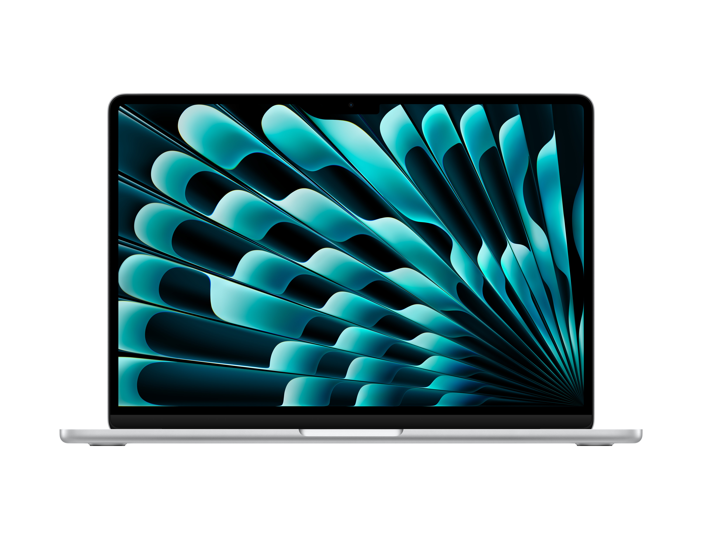

---

```PlainText
芯片：Apple M2
储存：512GB
内存：16GB
显示器：Liquid视网膜显示屏
颜色：银色
```

作为我的主力 macbook，我会用它来写代码、写文章、整理笔记、处理图片和其他工作。但作为一个主力机，我认为他的配置还是过于低。比如储存，512GB 对我来说必须非常节省的使用。

当然对于未来更长久的考虑，我应该会攒钱购买一个 `Apple M3 Pro 芯片 (12 核中央处理器、18 核图形处理器和 16 核神经网络引擎) + 36GB 统一内存 + 4TB 固态硬盘` 的 MacBook Pro，不过这需要我非常的努力才可以！